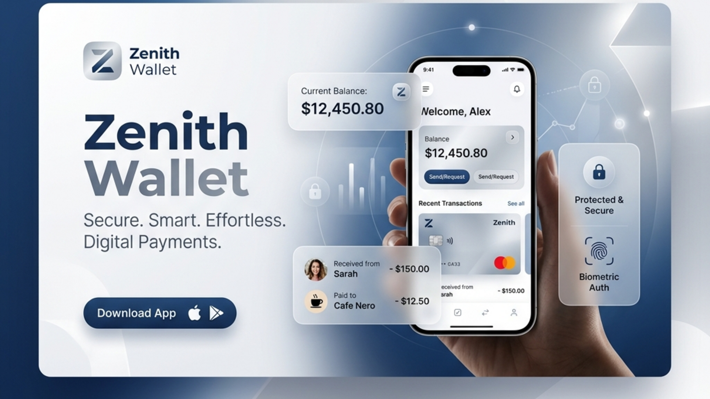

# Zenith Wallet



A sleek, ultra-modern personal finance and digital wallet application designed for effortless expense tracking and seamless secure payments.

## Core Features
- **Intuitive Dashboard:** Real-time balance tracking with fluid, responsive animations.
- **Transaction History:** Instantly log incoming and outgoing transactions.
- **Clean Architecture:** Minimalist frontend built for speed and security.
- **Cross-Platform:** Progressive Web App (PWA) ready, with touch-optimized interfaces for mobile devices.

## Setup
Simply clone the repository and serve the static files:
```bash
git clone https://github.com/Aboodseada1/zenith-wallet.git
cd zenith-wallet
# Serve using any static server, e.g., Live Server or Nginx
```
